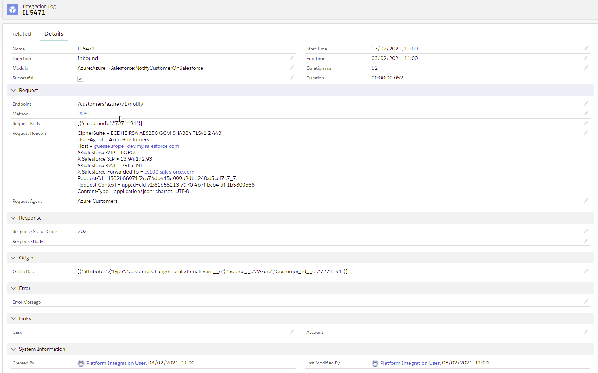

# Salesforce Integration Log

## Introduction

This project provides a solution to register logs for integrations between Salesforce and external systems.

It provides a nice UI to show the logs in realtime:


Each log collects all the required information needed to understand what was going on when with the integration operation:



## How To

You can embed calls to the integration log utility class that generates the logs within your inbound and outbound callouts. Here's a sample class that uses both techniques:

```java
@RestResource(urlMapping='/integration-log/*')
global class IntegrationLogServiceSample {
    public static final String MODULE = 'Test';

    // INBOUND

    @HttpPost
    global static void post() {
        Integer randomNumberForFailure = Integer.valueof((math.random() * 10));
        Boolean fail = Math.mod(randomNumberForFailure,2) == 0 ? true : false;

        Integer randomNumberForModule = Integer.valueof((math.random() * 10));
        List<String> modules = new List<String> { 'SAP', 'Siebel', 'Odoo', 'Prestashop'};
        String requestModule = modules[Math.mod(randomNumberForModule,modules.size())];


        Integration_Log_Event__e log = IntegrationLogUtility.newLog(requestModule,String.valueOf(IntegrationLogUtility.Direction.Inbound));

        try {
            Request request = (Request)JSON.deserialize(RestContext.request.requestBody.toString(), Request.class);

            RestContext.response.headers.put('Content-Type','application/json');
            if(fail) {
                RestContext.response.statusCode = 400;
                RestContext.response.responseBody = Blob.valueOf('{"error": "Something is wrong"}');
                throw new IntegrationLogServiceException('Failed');
            }
            else {
                RestContext.response.statusCode = 200;
                RestContext.response.responseBody = Blob.valueOf('{"result": "ok"}');
            }
        }
        catch(Exception e) {
            String error = e.getMessage() + '\r\n' + e.getStackTraceString();
            System.debug(error);
            log.Error_Message__c = error;
        }
        finally {
            IntegrationLogUtility.includeRestContext(log);
            IntegrationLogUtility.publishLog(log);
        }
    }

    public class Request {
        public String info {get; set;}
    }

    // OUTBOUND

    public static void SimulateOutboundSuccessCall() {
        Integration_Log_Event__e log = IntegrationLogUtility.newLog(MODULE,String.valueOf(IntegrationLogUtility.Direction.Outbound));
        try {
            Http http = new Http();
            HttpRequest request = new HttpRequest();
            request.setMethod('POST');
            request.setEndpoint('callou:Postman_Echo/post');
            request.setHeader('Content-Type','application/json');
            request.setBody('{"name": "Giovanni"}');
            IntegrationLogUtility.includeHttpRequest(log, request);
            HttpResponse response = http.send(request);
            IntegrationLogUtility.includeHttpResponse(log, response);

            if(response.getStatusCode() != 200) {
                throw new IntegrationLogServiceException('Failed. Status: ' + response.getStatus());
            }
        }
        catch(Exception e) {
            String error = e.getMessage() + '\r\n' + e.getStackTraceString();
            System.debug(error);
            log.Error_Message__c = error;
        }
        finally {
            IntegrationLogUtility.publishLog(log);
        }
    }

    public static void SimulateOutboundErrorCall() {
        Integration_Log_Event__e log = IntegrationLogUtility.newLog(MODULE,String.valueOf(IntegrationLogUtility.Direction.Outbound));
        try {
            Http http = new Http();
            HttpRequest request = new HttpRequest();
            request.setMethod('GET');
            request.setEndpoint('callou:Postman_Echo/basic-auth');
            request.setHeader('Content-Type','application/json');
            IntegrationLogUtility.includeHttpRequest(log, request);
            HttpResponse response = http.send(request);
            IntegrationLogUtility.includeHttpResponse(log, response);

            if(response.getStatusCode() != 200) {
                throw new IntegrationLogServiceException('Failed. Status: ' + response.getStatus());
            }
        }
        catch(Exception e) {
            String error = e.getMessage() + '\r\n' + e.getStackTraceString();
            System.debug(error);
            log.Error_Message__c = error;
        }
        finally {
            IntegrationLogUtility.publishLog(log);
        }
    }

    public class IntegrationLogServiceException extends Exception {}
}
```

## Installation

### Install Using SFDX

To install this solution using SFDX, follow these steps

1. Download the source code from this repo
2. Execute the following from the root folder:

```
sfdx force:source:deploy -u [org] -p ./force-app
```

### Install Using Deploy To Salesforce

Click on this button to deploy to your org:

<a href="https://githubsfdeploy.herokuapp.com">
  
</a>

## Bugs and Feedback

To report issues, open a [bug on GitHub](https://github.com/gmodica/salesforce-integration-log/issues/new?template=Bug_report.md). If you would like to suggest a feature, create a [feature request on GitHub](https://github.com/gmodica/salesforce-integration-log/issues/new?template=Feature_request.md).


## License
This project is licensed under the terms of the [MIT license](LICENSE).